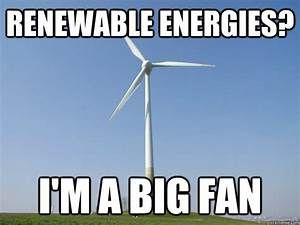

# SE-Europe-Data_Challenge

### About The Project: 

Hackathon organized by NUWE and Schneider Electric ([Link to Event](https://nuwe.io/dev/competitions/schneider-electric-european-2023))

Team: CleanCoders

||Description|
|------|---------------------------------------------------------------------------------------------------------------|
| Goal | Predict which European country (by code 1 to 9) will have the highest surplus of green energy in the next hour. |
| Forecast Variable | The surplus of green energy is the difference between the summation of all generated green energy and the consumed energy (load). |
| Data | You can only use data up to 2023-01-01. |

### Repo Structure
 
     |__README.md
     |__requirements.txt
     |
     |__data
     |  |__processed_data.csv
     |  |__[...]                      # various gen and load .csv files for each country
     |
     |__src
     |  |__data_ingestion.py          # import data and save to .csv files in ./data
     |  |__data_processing.py         # preprocess data (reindex, interpolate, features, and labeling)
     |  |__model_training.py          # train SARIMA model
     |  |__model_prediction.py        # output predictions
     |  |__utils.py                   # util functions to process get requests to ENTSO-E API                      
     |
     |__models
     |  |__model.pkl
     |
     |__z_notebooks
     |  |__[...]                      # various ipynb for exploratory data analysis etc
     |
     |__scripts
     |  |__run_pipeline.sh
     |
     |__predictions
     |  |__predictions.json

### Data Import

get ENTSOE Data through API

with security tokens:
- 1d9cd4bd-f8aa-476c-8cc1-3442dc91506d
- fb81432a-3853-4c30-a105-117c86a433ca

### Data Processing

Green energies are defined as: ["B01", "B09", "B10", "B11", "B12", "B13", "B15", "B16", "B18", "B19"].  
(See ENTSO-E [documentation](https://transparency.entsoe.eu/content/static_content/Static%20content/web%20api/Guide.html#_psrtype:~:text=Hourly-,A.5.%20PsrType,-Code) for further information.)

| Code | Meaning |
|------|--------|
| B01 | Biomass |
| B09 | Geothermal |
| B10 | Hydro Pumped Storage |
| B11 | Hydro Run-of-river and poundage |
| B12 | Hydro Water Reservoir |
| B13 | Marine |
| B15 | Nuclear |
| B16 | Solar |
| B18 | Wind Offshore |
| B19 | Wind Onshore |

-> The key is in the resampling of 1 hour intervals.
    - Is it possible to group data where there is more than one data in an hour? Yes, in fact that's what you should do! Example: I have 4 values in the same hour, I will have to find the most reliable way to represent those 4 values as one.
    - If I only have data for one hour, what do I do? Only the data of that hour is taken, the other 23 hours are not taken.
    - If I have only 15 minutes of data for one hour, what do I do? There are operations that can be applied to fill in the other 3 and get the value of the hour. This is for you to decide.

-> When is it considered that there is no data? The key is that you have to gather all countries and adjust the intervals regularly to 1H, when there are countries that have no data at a certain time or day, that is simply 0 (or the NaN should be set to 0 as the challenge explains, it is part of handling the missing data).

-> How to interpolate the data: "Missing values in the dataset should be imputed as the mean between the preceding and following values". 
    Example:
    #Interpolate any missing data
    df.interpolate(method='linear', limit_direction='both', inplace=True)

---

Missing values in the dataset should be imputed as the mean between the preceding and following values. Data with resolution finer than 1 hour must be resampled to an hourly level.

identify what energy types each column represent, and discard the ones that are not green energy sources (You can refer to the ENTSO-E Transparency portal API documentation to understand how the energy source types are represented)

end up with a single CSV file which includes columns per country representing the following values: generated green energy per energy type (one column per wind, solar, etc), and load. Make sure that all those values are in the same units (MAW).

check the exact columns that will need to appear in your dataset by looking at the test.csv file provided inside the data folder.

You will also need to add an additional column that will be your label: the ID of the country with the bigger surplus of green energy for the next hour.
The country IDs used to evaluate your model will be the following:

| Country Label | Code | Name             |
|---------------|------|------------------|
| SP            | 0    | Spain            |
| UK            | 1    | United Kingdom   |
| DE            | 2    | Germany          |
| DK            | 3    | Denmark          |
| HU            | 5    | Hungary          |
| SE            | 4    | Sweden           |
| IT            | 6    | Italy            |
| PO            | 7    | Poland           |
| NL            | 8    | Netherlands      |

### Model

SARIMA-X from statsmodels

### Train Test Split

### Evaluation
